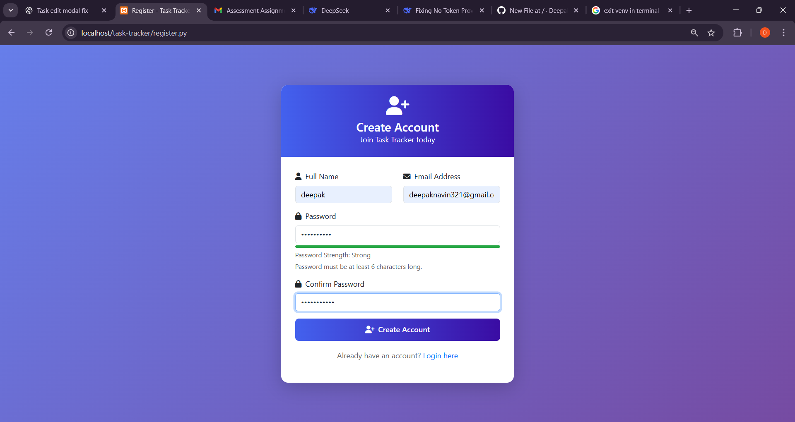
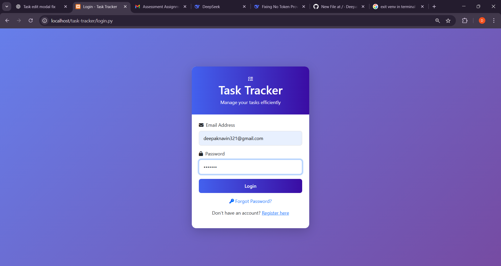
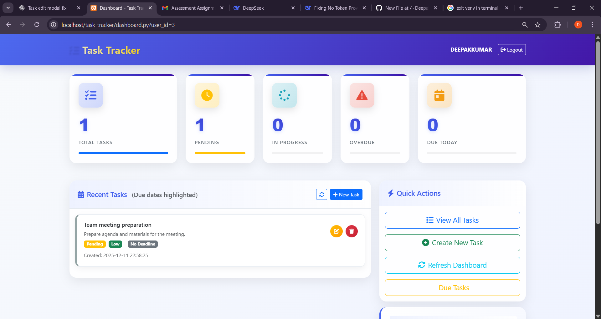

# Task Tracker 📋

A professional task management system built with Python CGI, MySQL, and modern web technologies. Manage your tasks efficiently with a beautiful dashboard, email reminders, and powerful task management features.


## 🌟 Features

- ✅ User authentication & secure login
- 📊 Interactive dashboard with task statistics
- 📝 Full CRUD operations for tasks
- 🔔 Email reminders for due tasks
- 🎨 Modern, responsive UI with Bootstrap 5
- 📱 Mobile-friendly design
- 🔄 Real-time task updates
- 📅 Due date tracking with visual indicators
- 🏷️ Priority-based task organization

## 🚀 Tech Stack

### Backend
- **Python 3.11** - Core programming language
- **CGI** - Common Gateway Interface for web server communication
- **PyMySQL** - MySQL database connector
- **SMTP** - Email notification system

### Frontend
- **HTML5** - Markup language
- **CSS3** - Styling with modern features
- **JavaScript (ES6+)** - Client-side interactivity
- **Bootstrap 5** - Responsive UI framework
- **Font Awesome** - Icon library


### Database
- **MySQL 8.0** - Relational database management system

### Server
- **Apache HTTP Server** - Web server with CGI support

## 📸 Screenshots

### Register Page


### Login Page


### Dashboard


### Task Management


## 🛠️ Setup Instructions

### Prerequisites
- Python 3.11 or higher
- MySQL 8.0 or higher
- Apache HTTP Server (or any CGI-enabled web server)
- SMTP server access (for email notifications)

### Step 1: Clone the Repository
```bash
git clone https://github.com/yourusername/task-tracker-pro.git
cd task-tracker-pro
```

## 🔐 Default Login Credentials

Use the following credentials to log in to the application:

**Username:** surya@gmail.com 

**Password:** 123456

> ⚠️ *These credentials are for testing/demo purposes only.  
Please change the password after logging in for the first time.*
